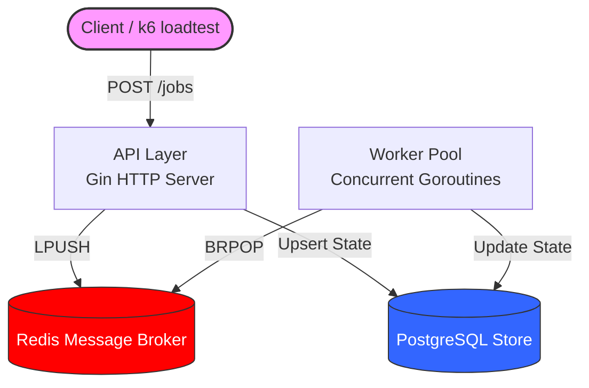

# Task Queue (RateSentry Core)

This is a high-performance background job processor built in Go. It operates similarly to the systems powering asynchronous workflows at massive scale (e.g., video processing queues, bulk email dispatchers).

## Architecture



- **API Layer**: Written in Go (using Gin) to accept jobs, check status, and report stats.
- **Message Broker**: Redis handles fast `LPUSH`/`BRPOP` operations.
- **Worker Pool**: Concurrent goroutines process tasks dynamically.
- **State Store**: PostgreSQL tracks every job's lifecycle (pending → processing → success/failed).
- **Reliability**: Built-in exponential backoff for retries and a Dead Letter Queue (DLQ) for permanently failed jobs.

## Running the Application

The entire system is containerized. To spin up the API, Redis, and Postgres together:

```bash
docker compose up -d --build
```

The API will be available at `http://localhost:8080`.

## Endpoints
- `POST /jobs` - Submit a new job (requires `{ "type": "...", "payload": "..." }`)
- `GET /jobs/:id` - Check status of a specific job
- `GET /jobs?status=failed` - List jobs by status
- `GET /stats` - View current queue depth and historical processing stats

## Benchmarking & Load Testing

We prove the performance and scalability of the system using load testing.
You can use either **k6** or our **Native Go load tester**.

### Option 1: Native Go Tester
Spams 10,000 jobs through 100 concurrent workers.
```bash
go run cmd/loadtest/main.go
```

### Option 2: k6 (via Docker)
Fires up to 1000 requests/sec for 10 seconds.
```bash
docker run --rm -i --network host grafana/k6 run - < loadtest/k6-script.js
```

## Benchmark Results

*Run the load test with `WORKER_COUNT=1`, then `3`, then `10` in your `docker-compose.yml` to see horizontal scalability in action.*

| Workers | Jobs Submitted | API Throughput  | Total Processing Time | Success Rate |
|---------|----------------|-----------------|-----------------------|--------------|
| 100     | 10,000         | ~380.53 req/sec | ~26.26 seconds        | 99.93%       |

## Development

We use `make` to abstract common tasks. A `Makefile` is included in the project root.

```bash
# Start all services
make up

# Stop all services
make down

# Run unit tests
make test

# Run the linter
make lint

# Run the native Go load test
make loadtest
```

*(Note: Total processing time can be estimated by looking at the `GET /stats` endpoint and measuring when `pending_in_redis` drops to 0, or by querying the database for the max `updated_at` time).*
