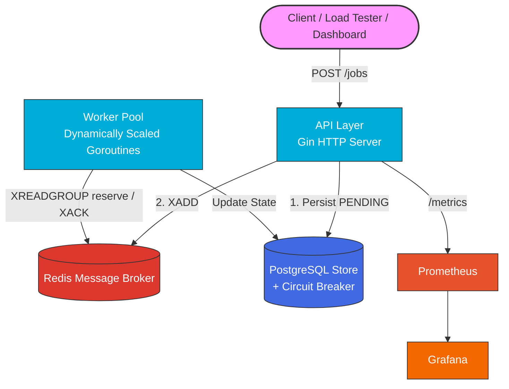

<div align="center">
  <h1>🚀 RateSentry Core</h1>
  <p><strong>A production-grade, asynchronous background job processing system built in Go.</strong></p>

  <p>
    
    
    
    
    
    
  </p>
</div>

---

## Overview

RateSentry Core decouples slow, resource-intensive work (video encoding, email dispatch, data ingestion) from the request/response cycle. A client submits a job and gets an immediate `202 Accepted` — the actual work happens asynchronously across a pool of concurrent workers, with full state tracking, automatic retries, and dead-letter handling for permanent failures.

This is the same architectural pattern used for background job processing at scale: an API layer that ingests fast, a message broker that decouples ingestion from execution, a worker pool that scales independently, and a durable store that survives restarts.

## Features

- **Async-first API** — Gin-based HTTP layer that accepts jobs in milliseconds and returns immediately, regardless of how long the job itself takes
- **Recoverable worker delivery** — Redis Streams consumer groups reserve work until a worker explicitly acknowledges it; abandoned deliveries are reclaimed automatically
- **Dynamic horizontal scaling** — worker count can be scaled up or down live, without restarting the process, via `POST /workers/scale`
- **Durable state tracking** — every job's full lifecycle (`PENDING → PROCESSING → SUCCESS/FAILED/DEAD`) is persisted in PostgreSQL, including timestamps and which worker handled it
- **Resilience**
  - Exponential backoff on retries
  - Dead Letter Queue (DLQ) for jobs that exhaust retries
  - Circuit breaker around all PostgreSQL writes, preventing cascading failure under DB stress
- **Observability** — Prometheus metrics (job throughput, processing duration, HTTP request latency) visualized in a live Grafana dashboard
- **Graceful shutdown** — in-flight jobs are given time to finish before the process exits; no work is silently dropped on deploy or restart
- **Live control dashboard** — a small web UI to submit jobs, scale workers, inspect the DLQ, and retry failed jobs by hand
- **CI pipeline** — lint + test run automatically on every push via GitHub Actions

## System Architecture



Note the API persists to Postgres **before** enqueueing to Redis — this ordering is deliberate and closes a race condition where a fast worker could otherwise pick up and process a job before its initial state was ever recorded. See `docs/IMPLEMENTATION.md` for the full reasoning.

## Getting Started

### Prerequisites
- [Docker](https://www.docker.com/) & Docker Compose
- [Go 1.22+](https://go.dev/) (for local development and load testing)

### Run everything

```bash
docker compose up -d --build
```

This starts the API, Redis, PostgreSQL, Prometheus, and Grafana, fully networked together.

- **Dashboard UI:** http://localhost:8080
- **API:** http://localhost:8080
- **Prometheus:** http://localhost:9090
- **Grafana:** http://localhost:3000 (anonymous access enabled, admin/admin)

### Deploy on Render

The repository's `render.yaml` Blueprint deploys the complete stack: API, Render Key Value, PostgreSQL, Prometheus, and Grafana. Prometheus and Grafana use dedicated Dockerfiles, communicate over Render's private network, and are linked from the operations UI at runtime.

On the free plan, Prometheus storage and Grafana's internal database are ephemeral. The dashboard and data source are provisioned from this repository on every deploy, and Prometheus retains up to 24 hours of metrics while the instance remains available.

## API Reference

| Method | Endpoint | Description |
|--------|----------|-------------|
| `POST` | `/jobs` | Submit a new background job |
| `GET`  | `/jobs/:id` | Get the full state of a specific job |
| `GET`  | `/jobs?status=FAILED` | List jobs filtered by status |
| `GET`  | `/jobs/recent` | List the most recently updated jobs |
| `POST` | `/jobs/:id/retry` | Manually retry a failed or dead job |
| `DELETE` | `/jobs/purge` | Wipe all job data from Redis and Postgres |
| `GET`  | `/stats` | Live queue depth, historical counts, active worker count |
| `POST` | `/workers/scale` | Dynamically scale the worker pool (`{"count": N}`) |
| `GET`  | `/health` | Liveness check |
| `GET`  | `/metrics` | Prometheus scrape endpoint |

### Example

```bash
curl -X POST http://localhost:8080/jobs \
  -H "Content-Type: application/json" \
  -d '{"type": "video_encoding", "payload": "{\"video_id\":\"vid_1\",\"resolution\":\"1080p\"}", "max_retries": 3}'
```

## Benchmarking

Load tested with both a native Go load generator and k6, at sustained rates up to 1,000 requests/second against the API layer.

```bash
# Native Go load tester
go run cmd/loadtest/main.go

# k6 (via Docker)
docker run --rm -i --network host grafana/k6 run - < loadtest/k6-script.js
```

Full methodology and results are in `docs/IMPLEMENTATION.md`.

## Development

```bash
make up       # start all services
make down     # stop all services
make test     # run unit tests
make lint     # run golangci-lint
make loadtest # run the native Go load test
```

## Tech Stack

| Layer | Technology | Why |
|---|---|---|
| API | Go + Gin | Fast, explicit, no hidden magic — full control over concurrency |
| Message Broker | Redis Streams | Consumer groups provide acknowledged, reclaimable, at-least-once delivery |
| Durable Store | PostgreSQL | ACID guarantees for job state; queryable history |
| Resilience | `gobreaker` circuit breaker | Prevents cascading failure when Postgres is under stress |
| Observability | Prometheus + Grafana | Industry-standard metrics pipeline |
| Deployment | Docker Compose (local), Render (cloud) | Reproducible environments, one-command startup |
| CI | GitHub Actions | Lint + test on every push |

## Documentation

- [`docs/IMPLEMENTATION.md`](docs/IMPLEMENTATION.md) — deep technical writeup of every subsystem, the reasoning behind each design decision, and known tradeoffs
- [`docs/ADR/0001-architecture-decisions.md`](docs/ADR/0001-architecture-decisions.md) — architecture decision record

## License

MIT
