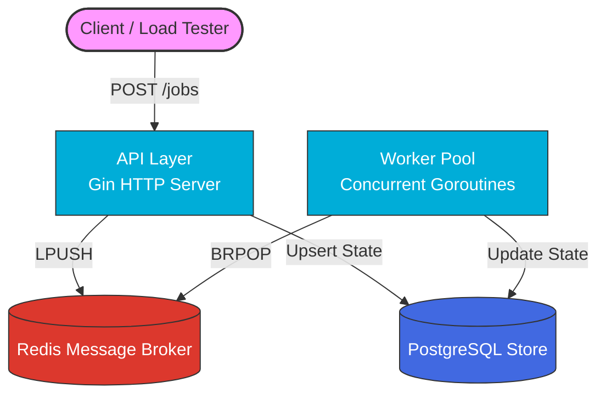

<div align="center">
  <h1>🚀 Task Queue (RateSentry Core)</h1>
  <p><strong>A high-performance, asynchronous background job processor built in Go.</strong></p>

  <!-- Badges -->
  <p>
    
    
    
    
  </p>
</div>

---

## 📖 Overview

This project is a massively scalable background task processing system designed to handle asynchronous workflows—similar to architectures used for video processing, bulk email dispatch, and heavy data ingestion. 

It guarantees **high throughput**, **fault tolerance**, and **exact state tracking** across distributed workers.

## ✨ Features

- **Blazing Fast API**: Built with `Gin`, handling hundreds of concurrent job submissions seamlessly.
- **Zero-Polling Worker Pool**: Uses Redis `BRPOP` for instantaneous, resource-efficient task dispatching.
- **Durable State Tracking**: Every job's lifecycle (Pending → Processing → Success/Failed) is safely persisted in PostgreSQL.
- **Resilience & Reliability**: 
  - Exponential backoff for automated retries on failure.
  - Dead Letter Queue (DLQ) for permanently failed tasks.
- **Production Ready**: Fully containerized with Docker, featuring CI pipelines, strict linting, and dependency injection for easy mocking/testing.

---

## 🏗️ System Architecture

The system utilizes a decoupled architecture where the API layer and the Worker Pool communicate asynchronously via Redis, using PostgreSQL as the source of truth for job states.



---

## 🚀 Getting Started

The entire infrastructure (API, Workers, Redis, Postgres) is bundled in a single Docker Compose configuration.

### Prerequisites
- [Docker](https://www.docker.com/) & Docker Compose
- [Go 1.22+](https://go.dev/) (For local development and load testing)

### Spin up the Environment

```bash
docker compose up -d --build
```
*The API will be available at `http://localhost:8080`.*

---

## 🌐 API Reference

| Method | Endpoint | Description | Payload Example |
|--------|----------|-------------|-----------------|
| `POST` | `/jobs` | Submit a new background job | `{"type": "email", "payload": "..."}` |
| `GET`  | `/jobs/:id` | Check the status of a specific job | - |
| `GET`  | `/jobs?status=failed` | List all jobs currently in a specific state | - |
| `GET`  | `/stats` | View current queue depth & historical processing stats | - |

---

## 📊 Benchmarking & Performance

We rigorously test the performance and horizontal scalability of the system using load testing tools. The benchmark below was run with **100 concurrent workers** processing **10,000 jobs**.

| Workers | Jobs Submitted | API Throughput | Total Processing Time | Success Rate |
|---------|----------------|----------------|-----------------------|--------------|
| 100     | 10,000         | ~376.35 req/sec | ~26.56 seconds        | 99.98%       |

### Run the Load Test Yourself

You can easily verify these numbers on your own machine. We provide both a native Go load tester and a `k6` script.

**Using Native Go:**
```bash
go run cmd/loadtest/main.go
```

**Using k6 (via Docker):**
```bash
docker run --rm -i --network host grafana/k6 run - < loadtest/k6-script.js
```

---

## 🛠️ Development & Testing

We provide a `Makefile` to abstract common development tasks. 
*(If you are on Windows without `make`, you can run the underlying `go` or `docker compose` commands directly!)*

```bash
# Start all services
make up             # or: docker compose up -d --build

# Stop all services
make down           # or: docker compose down

# Run unit tests
make test           # or: go test -v ./...

# Run the linter
make lint           # or: golangci-lint run ./...

# Run the native Go load test
make loadtest       # or: go run cmd/loadtest/main.go
```
